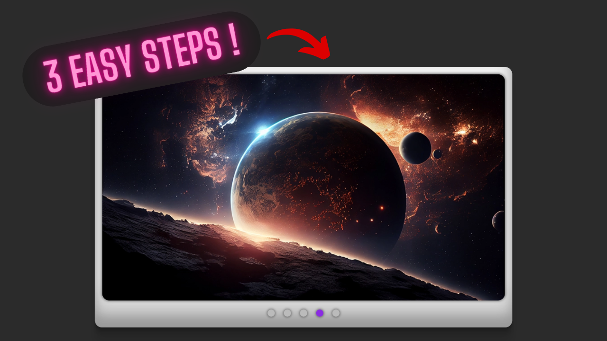

# Simply slider Project



This repository serves as a starting point for users to fork and follow along with tutorials on the Musical Coding
YouTube channel.

## Installation

To get started with this project, follow these steps:

1. **Clone the repository**:

```shell
  git clone https://github.com/musicalcoding-dev/simply_slider.git
```

2. **Navigate to the project directory**:

```shell
cd YOUR_PROJECT_DIR
```

3. **Install the dependencies**:

```shell
npm install
```

## Usage

- **Development mode**: To run the project in development mode with live reloading, use the following command:

```shell
npm run dev
```

This will start a local development server at `http://localhost:5173`.

- **Build**: To build the project for production, use the following command:

```shell
npm run build
```

The production-ready files will be generated in the `dist` directory.

- **Preview**: To preview the production build locally, use the following command:

```shell
npm run preview
```

This will start a local server to preview the production build.

## Dependencies

This project uses Vite as a development tool. You can find more information about Vite [here](https://vitejs.dev/).

## Contributing

If you would like to contribute to this project, please open an issue or create a pull request.

Happy coding!
